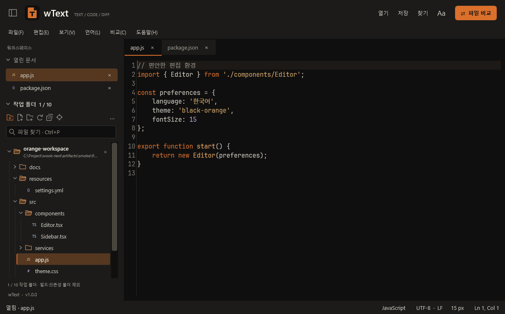
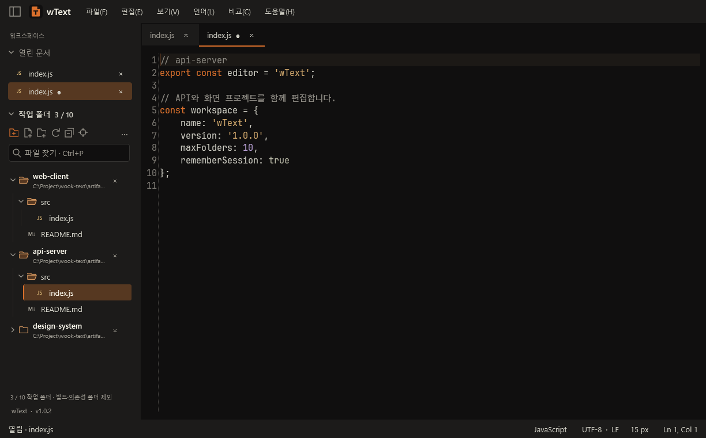
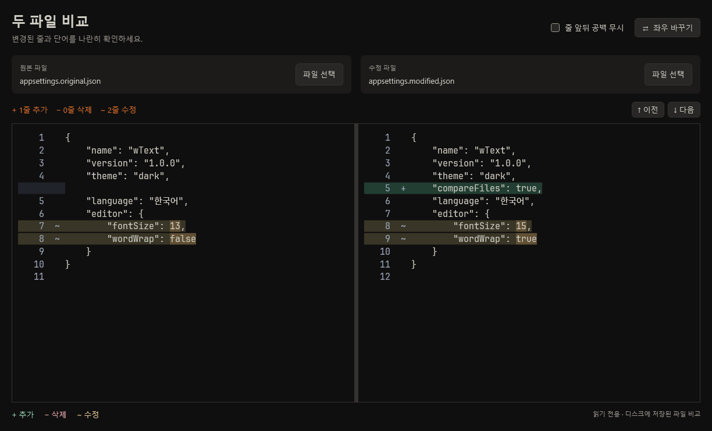
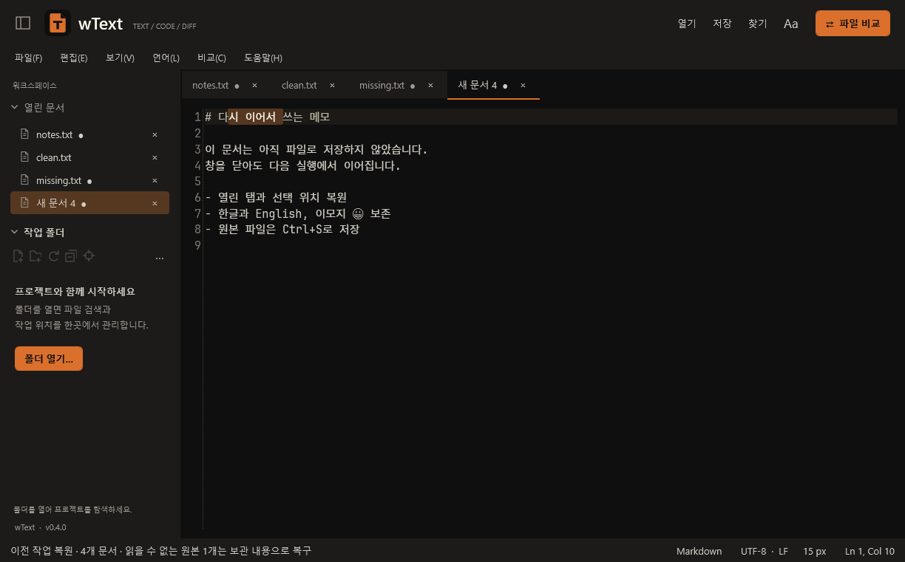
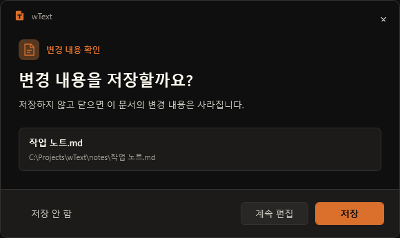
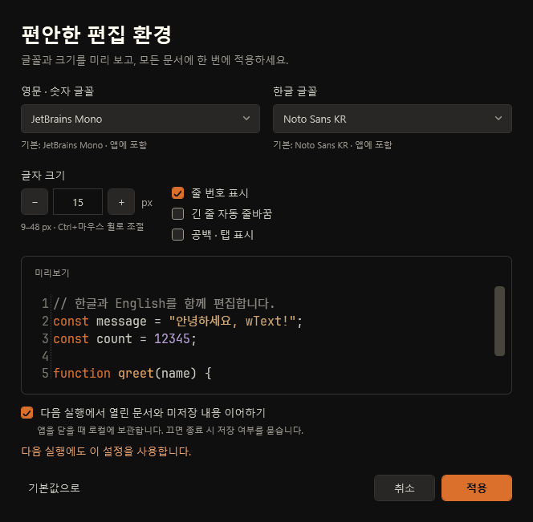
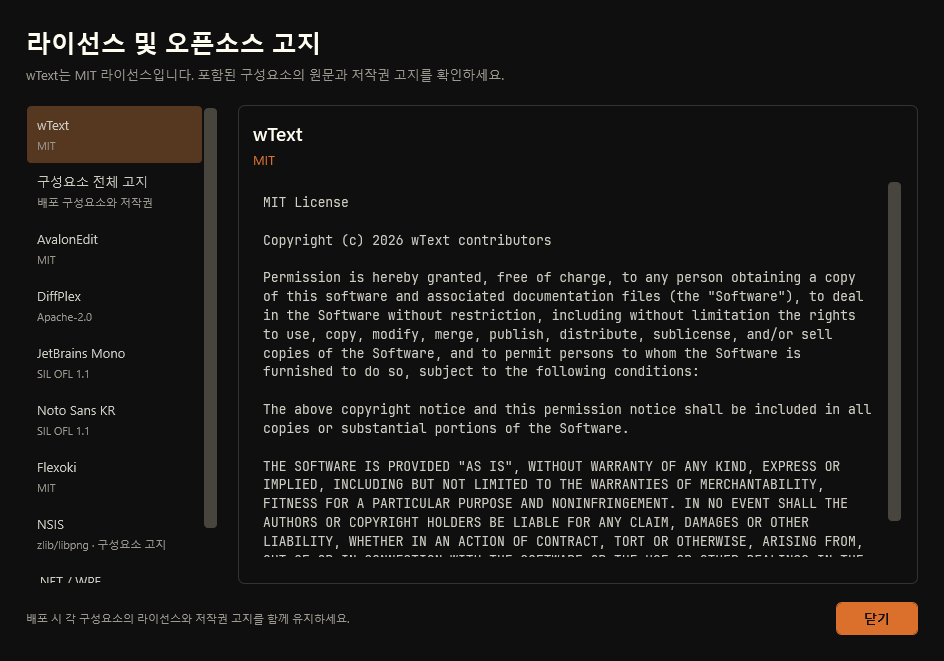

# wText

Windows x64용 무료 텍스트 편집기입니다. **1.0.1**은 설치 마법사에 바탕화면 바로가기 생성 옵션을 추가했습니다. 작업 폴더를 최대 10개까지 함께 관리하며, 블랙·오렌지 테마의 확인창을 제공합니다. 열린 탭과 미저장 내용 복원, 다국어 구문 강조, 글꼴 설정, 집중 모드와 두 파일 비교를 지원합니다. 제작자는 **Hyunwook Park**이며 [GitHub 프로젝트](https://github.com/parkhw328/wook-text)에서 소스와 의견을 확인할 수 있습니다.

## 최신 버전 다운로드

**wText 1.0.1 · Windows x64** — [최신 릴리스 및 변경 내용](https://github.com/parkhw328/wook-text/releases/latest)

| 배포 형태 | 다운로드 | 실행 방법 |
| --- | --- | --- |
| 설치형 | [Windows 설치 파일 (.exe)](https://github.com/parkhw328/wook-text/releases/download/v1.0.1/wText-1.0.1-win-x64-setup.exe) | 다운로드한 파일을 실행해 설치 |
| 무설치형 | [무설치 ZIP](https://github.com/parkhw328/wook-text/releases/download/v1.0.1/wText-1.0.1-win-x64-portable.zip) | **전체 압축 해제**한 뒤 `wText.exe` 실행 |

[SHA-256 체크섬](https://github.com/parkhw328/wook-text/releases/download/v1.0.1/SHA256SUMS.txt) · [전체 버전 목록](https://github.com/parkhw328/wook-text/releases)

배포본에는 .NET 런타임이 포함됩니다. 설치 마법사는 현재 사용자 폴더와 시작 메뉴에 설치하며 관리자 권한이 필요하지 않습니다. Windows 설정의 앱 목록에서 제거할 수 있습니다. 기존 텍스트 파일 연결은 변경하지 않습니다.

설치 중 **바로가기 설정 → 바탕화면에 wText 바로가기 만들기**를 선택할 수 있습니다. 처음에는 체크되어 있으며 재설치·업그레이드는 이전 선택을 기억합니다. 체크를 해제하면 기존 바탕화면 바로가기도 제거하고, 시작 메뉴 바로가기는 유지합니다. 프로그램 제거 시 두 바로가기를 함께 정리합니다.

## 화면으로 보는 사용법

### 파일을 찾아 편집하기

`Ctrl+Shift+O`로 프로젝트 폴더를 열고 `Ctrl+P`로 파일명·경로를 검색하세요. 왼쪽 탐색기에서 파일 형식과 폴더 구조를 구분하고, 우클릭이나 `F2`로 이름을 바꿀 수 있습니다. `Ctrl+Shift+E`는 편집 중인 파일의 위치를 찾아줍니다.



### 여러 작업 폴더 관리하기

탐색기의 **폴더 추가** 버튼이나 `Ctrl+Shift+O`로 최대 10개 폴더를 함께 여세요. 여러 폴더를 선택하거나 드롭할 수 있습니다. 각 폴더 행의 **×**로 개별 닫기, 우클릭으로 순서 변경, **···** 메뉴로 전체 닫기와 최근 폴더 다시 열기가 가능합니다. 폴더를 닫아도 파일과 편집 중인 문서는 유지됩니다.



### 두 파일의 차이 확인하기

상단 **파일 비교** 또는 `Ctrl+Shift+D`에서 두 파일을 선택하세요. 좌우의 추가·삭제·수정 줄과 변경된 단어를 함께 보여주며, 이전·다음 변경 버튼으로 이동할 수 있습니다. 비교 대상은 디스크에 저장된 파일이므로 편집 내용을 반영하려면 먼저 저장하세요.



### 닫았던 작업 이어하기

창의 **X** 또는 **파일 → 끝내기**는 기본적으로 탭과 미저장 내용을 로컬에 보관합니다. 다시 실행하면 문서 순서·선택한 탭·커서·선택 영역과 언어 모드를 복원합니다. 탭의 ● 표시는 아직 원본 파일에 저장하지 않은 내용이라는 뜻입니다.



### 저장 여부를 분명하게 선택하기

개별 탭을 닫으면 파일 이름과 경로가 표시된 확인창에서 **저장 / 저장 안 함 / 계속 편집**을 선택합니다. `Esc`나 확인창의 **×**도 계속 편집으로 처리합니다. 오류와 인코딩 확인도 같은 테마를 사용하며 긴 오류 내용은 **자세한 내용**에서 확인할 수 있습니다.



### 글꼴과 작업 보관 설정하기

상단 **Aa** 또는 `Ctrl+,`에서 한글·영문 글꼴과 크기를 미리 보고 적용하세요. **다음 실행에서 열린 문서와 미저장 내용 이어하기**를 끄면 종료할 때 저장 여부를 묻습니다. `Ctrl+B`로 사이드바를 숨기고 `F11`로 편집에 집중할 수도 있습니다.



### 라이선스 원문 확인하기

**도움말 → 라이선스 및 오픈소스 고지**에서 wText의 MIT 라이선스와 구성요소별 원문을 읽을 수 있습니다. **wText 정보**에서도 같은 화면으로 이동할 수 있으며, 글꼴의 OFL 고지와 배포 도구·런타임 고지도 포함합니다.



위 이미지는 실제 WPF 화면을 예제 문서로 렌더링한 것입니다. 클릭하면 원래 크기로 볼 수 있습니다.

## 현재 기능

- 다중 탭, 파일·폴더 드래그 앤 드롭, 실행 인자의 파일 열기
- 파일 형식별 아이콘·폴더 우선 자연 정렬, 비동기 프로젝트 탐색과 파일 이름·경로 검색
- 파일·폴더 생성과 이름 변경, 경로 복사, 현재 문서 위치 찾기, 외부 변경 자동 갱신
- 최대 10개 작업 폴더, 개별·전체 닫기, 목록 순서 변경, 최근 폴더 10개에서 다시 열기
- 열린 폴더 목록·순서·펼침 상태 복원, 숨김·빌드·의존성 폴더 표시 선택
- wShell을 참고한 블랙·오렌지 테마, 테두리 없는 메뉴, 작업표시줄에서 구분되는 문서/T 아이콘
- 열린 문서·탐색기 개별 접기, 사이드바 전체 숨기기·너비 조절, F11 집중 모드
- 영문·숫자 JetBrains Mono + 한글 Noto Sans KR 기본 글꼴 동봉; 설치된 글꼴 선택과 크기 미리보기
- 줄 번호, 자동 줄바꿈, 공백 표시, 글자 크기 조절, 실행 취소·다시 실행
- YAML, HTML, JavaScript, TypeScript, JSP, Java, JSON, XML, CSS, C#, C/C++, Python, SQL, PowerShell, Shell, INI/TOML/Properties, Markdown, PHP 및 일반 텍스트 모드
- 일반 텍스트 검색, 대소문자 구분, 바꾸기·모두 바꾸기
- UTF-8, BOM이 있는 UTF-16/32, 사용자 확인 후 CP949 열기와 원본 인코딩·줄바꿈 보존
- 창 종료 후 탭·미저장 내용 복원, 주기적인 로컬 복구본, 개별 탭을 버릴 때 저장 확인
- 테마에 맞춘 저장·인코딩 확인과 오류 알림, 문서 경로 표시와 선택 가능한 오류 상세 내용
- 외부 변경 감지, 임시 파일을 통한 원본 교체 저장, 도움말의 라이선스 원문 보기
- 두 파일의 추가·삭제·수정 줄 및 단어 표시, 스크롤 동기화, 변경 구간 이동, 공백 옵션, 줄바꿈·인코딩 차이 안내

파일 열기·저장은 16 MiB, 비교는 파일당 500,000자·20,000줄까지 지원합니다. 정규식 검색, 다중 커서, 미니맵, 비교 병합은 아직 제공하지 않습니다.

## 종료와 작업 복원

- **창 X / 끝내기:** 기본 설정에서는 저장 여부를 묻지 않고 현재 작업을 보관한 뒤 종료합니다. 파일에 반영할 때는 `Ctrl+S`를 사용하세요.
- **개별 탭 X / Ctrl+W:** 미저장 문서는 저장 여부를 묻습니다. **저장 안 함**으로 닫은 탭은 다음 실행에서 복원하지 않습니다.
- **작업 이어하기를 끈 경우:** 창을 닫을 때도 **저장 / 저장 안 함 / 계속 편집**으로 저장·버리기·종료 취소를 선택합니다.

복구본은 `%LocalAppData%\wText\sessions\`에 저장합니다. 입력이 멈춘 뒤 약 2초, 계속 입력 중에는 최대 10초 간격으로 백그라운드에 보관하고 정상 종료 시 마지막 변경까지 기록합니다. 보관에 실패하면 창을 열어 두어 내용을 저장하거나 다시 시도할 수 있습니다. 이전 복구본도 유지하며 손상된 파일은 덮어쓰지 않습니다.

저장한 뒤 수정하지 않은 파일은 재실행 시 최신 디스크 내용을 읽습니다. 미저장 버퍼는 보관 내용을 유지하며, 원본이 외부에서 바뀌었으면 덮어쓰기를 막습니다. 원본 파일이 없어졌거나 읽을 수 없으면 보관 내용으로 복구하고 안내합니다. 실행 취소 기록은 재실행 후 새로 시작합니다.

창별 보관 파일을 잠가 여러 실행이 같은 작업을 덮어쓰지 않도록 합니다. 여러 창을 사용했다면 가장 최근의 사용 가능한 작업부터 복원하며, 추가 실행에서 다른 보관 작업을 열 수 있습니다. 보관 한도는 창당 문서 256개·JSON 파일 128 MiB입니다. 강제 종료·전원 장애 때는 마지막 주기적 보관 이후 입력이 남지 않을 수 있습니다.

## 프로젝트 탐색기

`Ctrl+Shift+O` 또는 폴더 드롭으로 작업 폴더를 추가합니다. 기존 폴더를 유지하면서 최대 10개를 열며, 이미 열린 경로는 중복 추가하지 않습니다. 11번째 폴더는 기존 목록을 유지한 채 한도를 안내합니다.

화살표 키로 이동하고 `Enter`나 더블 클릭으로 파일을 여세요. `Ctrl+P`는 열린 폴더 전체에서 이름·상대 경로를 검색합니다. `src editor`처럼 공백으로 검색어를 조합하거나 `api-server index`처럼 작업 폴더 이름으로 좁힐 수 있습니다. 검색 결과에 소속 폴더를 표시하며, 전체 경로는 마우스를 올려 확인합니다.

탐색기 툴바에서 **새 파일·새 폴더·새로고침·모두 접기·현재 문서 찾기**를 실행할 수 있습니다. 우클릭 메뉴에는 이름 변경(`F2`), 상대·전체 경로 복사, Windows 탐색기에서 보기가 있습니다. 이름을 바꾸면 열린 문서의 경로도 바뀌며 미저장 내용과 실행 취소 기록을 유지합니다. 외부 파일 추가·삭제·이름 변경은 자동 반영하며 `F5`로 직접 갱신할 수도 있습니다.

| 폴더 정리 | 사용 방법 |
| --- | --- |
| 개별 접기·펼치기 | 작업 폴더 행의 화살표, 또는 선택 후 `Enter` |
| 개별 닫기 | 폴더 행의 **×**, 또는 우클릭 → **작업 폴더 닫기** |
| 순서 변경 | 작업 폴더 우클릭 → **목록에서 위로 / 아래로** |
| 전체 닫기 | **··· → 모든 작업 폴더 닫기** |
| 다시 열기 | **··· → 최근 작업 폴더**에서 선택; 최근 10개 유지 |
| 기록 정리 | **··· → 최근 폴더 기록 지우기** |

폴더 닫기는 탐색기 목록에서만 제거하며 파일과 열린 문서는 유지합니다. 작업 폴더 자체는 목록에서 닫은 후 상위 폴더에서 이름을 변경하세요. `.git`, `node_modules`, `bin`, `obj` 등의 생성 폴더와 Windows 숨김 항목은 기본적으로 제외하며 **···** 메뉴에서 다시 표시할 수 있습니다.

열린 폴더 목록·순서·각 폴더의 접힘 상태·하위 폴더 펼침 최대 200개씩·필터는 `%LocalAppData%\wText\settings.workspace.json`에 저장합니다. 0.4.0의 단일 폴더 설정은 자동으로 옮깁니다. 접근할 수 없는 폴더도 목록에 유지하므로 연결을 복구한 뒤 `F5`로 다시 읽거나 닫을 수 있습니다. 최종 목록 기록에 실패하면 창을 닫지 않습니다.

폴더는 필요할 때 불러오고 보이는 행 위주로 렌더링합니다. 폴더 하나당 파일·하위 폴더 합계 10,000개까지 표시하며, 파일 검색은 열린 작업 폴더 전체에 걸쳐 최대 100,000개 항목을 확인해 결과 200개까지 보여줍니다. 겹치는 작업 폴더의 같은 파일은 결과에서 중복 제거합니다. 한도 도달 시 검색어를 구체화하세요. 연결 폴더는 자동으로 순회하지 않습니다. 검색 대상은 파일 이름·경로이며 파일 내용 전체 검색은 후속 범위입니다.

## 편집 환경 설정

상단 **Aa**, 상태 표시줄의 글자 크기 또는 `Ctrl+,`로 설정을 엽니다. 한글·영문 글꼴을 따로 선택하고 9–48 px 범위에서 미리 본 뒤 적용하세요. 모든 탭과 비교창에 함께 반영되며 문서 내용·커서·실행 취소 기록은 유지됩니다. 비교창은 줄 정렬을 위해 자동 줄바꿈을 사용하지 않습니다.

확장자로 언어를 감지하며, **언어** 메뉴나 상태 표시줄에서 직접 바꿀 수 있습니다. 새 문서도 저장 전에 언어를 지정할 수 있고 **자동 감지**로 돌아갈 수 있습니다. 구문 강조는 어휘 기반이며 자동 완성이나 컴파일 오류 검사는 제공하지 않습니다.

글꼴·크기·편집 옵션과 사이드바 너비·표시·접힘 상태는 `%LocalAppData%\wText\settings.json`에 저장합니다. 설치형과 무설치형이 같은 사용자 설정을 사용합니다. 집중 모드는 일시적이며, 종료하면 기존 사이드바 표시 상태를 복원합니다. **도움말 → wText 정보**에는 제작자, 버전, GitHub 링크와 주소 복사가 있습니다.

## 개발 명령

Windows x64의 PowerShell에서 저장소 루트를 기준으로 실행합니다. 개발 SDK는 `global.json`에 고정되어 있습니다. 인터넷 연결은 도구·패키지 최초 다운로드에 필요합니다.

```powershell
.\scripts\bootstrap.ps1                 # .tools에 .NET SDK와 NSIS 설치, 체크섬 확인
.\scripts\build.ps1                     # 잠금 파일 복원, Release 빌드, 단위·WPF 검증
.\scripts\run.ps1                       # 개발 모드 실행
.\scripts\package.ps1                   # 런타임 포함 설치 EXE 및 무설치 ZIP 생성
.\scripts\package.ps1 -SmokeInstaller   # 격리된 설치 검증용 패키지 생성
.\scripts\test-installer.ps1            # 설치·재설치·제거 및 사용자 파일 보존 검증
.\scripts\make-icon.ps1                 # 벡터 원본에서 PNG와 다중 크기 ICO 재생성
.\scripts\update-screenshots.ps1        # WPF 검증 결과에서 README 화면 7개 갱신
```

패키징 결과는 `artifacts/installer/`의 설치 파일과 `artifacts/`의 무설치 ZIP에 생성됩니다. 게시 전 실행 파일은 `artifacts/publish/win-x64/wText.exe`입니다. 새 버전 배포 시 설치 파일·ZIP·`SHA256SUMS.txt`를 해당 GitHub 릴리스에 첨부하고 위 다운로드 버전과 링크를 함께 갱신하세요.

시스템 SDK 대신 `.tools/dotnet/dotnet.exe`를 사용할 수 있습니다.

```powershell
.\.tools\dotnet\dotnet.exe test tests/WookText.Core.Tests -c Release
.\.tools\dotnet\dotnet.exe format WookText.slnx --verify-no-changes
```

PowerShell 실행 정책 때문에 스크립트가 차단되면 명령별로 `powershell -NoProfile -ExecutionPolicy Bypass -File .\scripts\build.ps1`처럼 실행할 수 있습니다. 시스템 정책을 변경할 필요는 없습니다. 빌드와 패키징은 같은 `obj` 폴더를 사용하므로 동시에 실행하지 마세요.

설치 검증은 설치된 바이너리·글꼴에서도 WPF 검증을 실행하며 실제 사용자 설정을 건드리지 않습니다. 이전 검증용 설치 파일이 있다면 `test-installer.ps1 -PreviousSmokeInstaller artifacts/installer/wText-1.0.0-win-x64-setup-smoke.exe`로 업그레이드도 확인할 수 있습니다.

## 프로젝트 구조

| 경로 | 역할 |
| --- | --- |
| `src/WookText.App/` | WPF 화면, 편집·비교·설정·라이선스, `SessionCoordinator` 작업 보관, 테마·구문 정의 |
| `src/WookText.App/Explorer/` | 탐색기 화면·상태, 지연 로딩·자동 갱신, 파일명 입력창 |
| `src/WookText.App/Assets/` | 앱 아이콘, 기본 글꼴과 출처·체크섬 |
| `src/WookText.Core/` | 파일·인코딩·비교, `WorkspaceFiles` 탐색·파일 작업, `SessionStore` 복구본과 설정 저장 |
| `tests/WookText.Core.Tests/` | xUnit 파일·인코딩·비교·검색·탐색기·설정 회귀 테스트 |
| `tests/WookText.App.SmokeTests/` | 실제 WPF 컨트롤 동작 검증과 화면 렌더링 |
| `installer/`, `scripts/` | NSIS 설치 정의 및 개발·배포 자동화 |
| `rules/rules.md` | 제품 결정과 개발 규칙 |
| `docs/REQUIREMENTS.md` | 요구사항 분석, 수용 기준, 후속 범위 |
| `docs/images/` | README의 실제 앱 화면 |
| `licenses/` | 의존성 라이선스 원문 |
| `artifacts/` | 실행 파일, 설치 패키지, 화면 검증 결과; Git 제외 |

## 단축키

| 단축키 | 동작 |
| --- | --- |
| `Ctrl+N`, `Ctrl+O`, `Ctrl+S` | 새 문서, 열기, 저장 |
| `Ctrl+Shift+S`, `Ctrl+W` | 다른 이름으로 저장, 탭 닫기 |
| `Ctrl+F`, `Ctrl+H`, `F3` | 찾기, 바꾸기, 다음 찾기 |
| `Ctrl+Z`, `Ctrl+Y` | 실행 취소, 다시 실행 |
| `Ctrl+Tab`, `Ctrl+Shift+Tab` | 다음·이전 탭 |
| `Ctrl+Shift+D` | 두 파일 비교 |
| `Ctrl+Shift+O`, `Ctrl+P` | 작업 폴더 추가, 열린 폴더 전체 이름·경로 검색 |
| `Ctrl+Shift+E` | 탐색기에서 현재 문서 찾기 |
| `F2`, `F5` | 탐색기에서 이름 변경, 새로고침 |
| `Ctrl+Shift+C` | 탐색기에서 선택 항목의 전체 경로 복사 |
| `Ctrl+B` | 사이드바 접기·펼치기 |
| `F11`, `Esc` | 집중 모드 전환, 검색 닫기·집중 모드 나가기 |
| `Ctrl+,` | 글꼴 및 편집 설정 |
| `Ctrl+마우스 휠`, `Ctrl++`, `Ctrl+-` | 글자 크게·작게 |
| `Ctrl+0` | 기본 글자 크기 15 px |

## 기여 및 버전 관리

개발 지침은 `AGENTS.md`와 `rules/rules.md`, 버전 기록은 `CHANGELOG.md`를 확인하세요. C#은 공백 4칸과 `.editorconfig`를 따르며 `dotnet format`을 사용합니다. 테스트명은 `Method_Condition_ExpectedResult` 형식입니다. 수치 기반 커버리지 기준은 아직 없으며 파일 손상 방지와 기능별 회귀 검증을 우선합니다.

커밋은 `Add encoding preservation tests`처럼 변경 의도가 드러나는 짧은 명령형으로 작성합니다. PR에는 관련 요구사항, 검증 결과, UI 변경 화면을 포함하세요.

## 라이선스

자체 코드는 [MIT](LICENSE)입니다. AvalonEdit(MIT), DiffPlex(Apache-2.0), JetBrains Mono·Noto Sans KR(OFL-1.1), Flexoki(MIT), .NET/WPF, NSIS의 고지는 [THIRD-PARTY-NOTICES.md](THIRD-PARTY-NOTICES.md)를 확인하세요. 글꼴은 앱 폴더에서 직접 불러오며 Windows에 별도로 설치하지 않습니다. Sublime Text와 Notepad++는 사용성 참고 대상이며 해당 제품의 코드나 이미지를 포함하지 않습니다.
